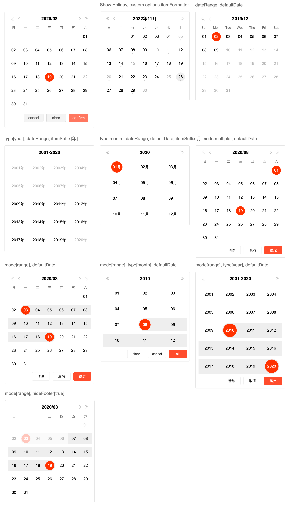

# zx-calendar

zx-calendar, zx-vue-calendar (Vue2.x.x and Vue3.x.x), zx-react-calendar

<p align="left">
  <a href="https://npmcharts.com/compare/zx-calendar?minimal=true"></a>
  <a href="https://www.npmjs.com/package/zx-calendar"></a>
  <a href="https://www.npmjs.com/package/zx-calendar"></a>
</p>

https://capricorncd.github.io/calendar/dist/index.html



#### Vue docs and example

Vue 2.x.x

https://capricorncd.github.io/calendar/dist/vue.html

Vue 3.x.x

https://capricorncd.github.io/calendar/dist/vue3.html

#### React docs and example

https://capricorncd.github.io/calendar/dist/react.html

[简体中文](docs/)

### Browser Support

IE10+ (When it is used in IE browser, Polyfill needs to be introduced)

## Install

```bash
# npm
npm install zx-calendar -S

# yarn
yarn add zx-calendar
```

### Setup and Dev

```bash
# setup
npm install

# start default demo
npm run dev
# start vue2.x.x demo
npm run vue
# start vue3.x.x demo
npm run vue3
# start react demo
npm run react
```

## Usage

```javascript
import ZxCalendar from 'zx-calendar'

const options = {}

// create an instance
const zxCalendar = new ZxCanlendar(options)

// on change
zxCalendar.on('change', data => {
  console.log(data)
})

// cancel button on click
zxCalendar.on('cancel', () => {
  // ...
})

// on error
zxCalendar.on('error', err => {
  console.error(err)
})
```

#### Options

```javascript
// options
const options = {
  // element selector or element  
  el: '#app',
  // date/month/year
  type: 'date',
  // zh/jp/en that week and button text
  lang: 'zh',
  // 星期一(省略形式: 一)
  isFullWeek: false,
  // title formatter of header
  // type date: yyyy/MM
  // type month: yyyy
  // type year: yyyy-yyyy
  titleFormatter: 'yyyy/MM',
  // item suffix, 日/月/年
  itemSuffix: null,
  // default selected date
  // yyyy-MM-dd, yyyy/MM/dd, yyyy, timestamp, Array
  defaultDate: null,
  // selectable date range array
  // [startDate, endDate]
  dateRange: [],
  // show holiday info
  showHoliday: false,
  // function, custom item handler
  // return object {text: string, value: number, fullText: string, disabled: boolean, ...}
  itemFormatter: null,
  // Selection mode: single/multiple/range
  mode: 'single',
  // language package
  langPackage: {
    confirmButton: 'ok',
    cancelButton: 'cancel',
    clearButton: 'clear',
    weeks: ["日", "一", "二", "三", "四", "五", "六"]
  },
  // footer buttons
  // show clear, cancle and confirm button when mode=multiple/range
  footerButtons: ['clear', 'cancel', 'confirm'],
  // only show confirm button
  // footerButtons: ['confirm'],
  // change button display order
  // footerButtons: ['confirm', 'clear', 'cancel'],
  // ...
  // justify-content
  footerButtonAlign: 'flex-end',
  // hide buttons of footer when mode is multiple/range
  hideFooter: false,
}
```

## Vue

https://capricorncd.github.io/calendar/dist/vue.html

```html
<template>
  <zx-vue-calendar 
    v-model="value" 
    @change="handleChange"
    @cancel="handleCancel"
    @error="handleError" />
</template>

<script>
/** Vue 2.x.x */
import { ZxVueCalendar } from 'zx-calendar/lib/vue-calendar'

export default {
  components: {
    ZxVueCalendar
  },
  data() {
    return {
      value: ''
    }
  },
  methods: {
    handleChange(value, orignal) {
      console.log(value, orignal)
    },
    handleCancel() {
      console.log('button cancel on click!')
    },
    handleError(err) {
      console.error(err)
    }
  }
}
</script>
```

### Vue 3.x.x

```javascript
/** Vue 3.x.x */
import { ZxVueCalendar } from 'zx-calendar/lib/vue3-calendar'

const App = {
  components: {
    ZxVueCalendar
  },
  data() {
    return {
      date: '1990/09/12'
    }
  },
  template: `
    <div>
      <h2>{{ date }}</h2>
      <ZxVueCalendar v-model="date"></ZxVueCalendar>
    </div>
  `
}

Vue.createApp(App).mount('#app')
```

|Props|Type|Default|Description|
|:--|:--|:--|:--|
|v-model|`string, timestamp, array`|`''`|Date selected by default|
|* value|`string, timestamp, array`|`''`|(Only for Vue2.x.x), Date selected by default|
|* model-value|`string, timestamp, array`|`''`|(Only for Vue3.x.x), Date selected by default|
|date-range|`array`|`[]`|Set selectable date range, `[startDate, endDate]`|
|footer-buttons|`array`|`undefined`||
|footer-button-align|`string`|`flex-end`|Optional values: flex justify-content values|
|format|`string`|`''`|Example: `yyyy/MM/dd`|
|hide-footer|`boolean`|`false`|hide footer button wrapper|
|is-full-week|`boolean`|`false`|Monday: isFullName: `Monday`, default: `Mon`|
|item-formatter|`function`|`undefined`|custom item handler, return an object {text: string, value: number, fullText: string, disabled: boolean, ...}|
|item-suffix|`string`|`''`|Example: date `日` month: `月`, year: `年`|
|lang|`string`|`en`|Optional values: `en/zh/jp`|
|lang-package|`object`|`undefined`||
|mode|`string`|`single`|Optional values: `single/multiple/range`|
|show-holiday|`boolean`|`false`|show holiday info|
|type|`string`|`date`|Optional values: `date/month/years`|
|title-formatter|`string`|date `yyyy/MM` month: `yyyy`, year: `yyyy-yyyy`|Set title display format|

## React

https://capricorncd.github.io/calendar/dist/react.html

```jsx
import React, { Component } from 'react'
import { ZxReactCalendar } from 'zx-calendar/lib/react-calendar'

class App extends Component {
  constructor(props) {
    super(props)
    this.state = {
      date: '2020/09/05'
    }
  }

  handleChange() {
    console.log.apply(null, arguments)
  }

  render() {
    return <div>
      <ZxReactCalendar
        value={this.state.date} 
        change={(...args) => this.handleChange(...args)}/>
    </div>
  }
}
```

## Methods

### setDate(date)

Set selected date

|parameter|type|required|remark|
|:--|:--|:--|:--|
|date|`string/timestamp/Date` or `Array[string/timestamp/Date]`, `null`|no|-|

```javascript
// mode: single
// set select date
zxCalendar.setDate('2020/08/10')
zxCalendar.setDate('2020/08/10 22:14:59')
// clear selected date
zxCalendar.setDate()

// mode: multiple
zxCalendar.setDate(['2020/08/01', '2020/08/05', '2020/08/10'])

// mode: range
zxCalendar.setDate(['2008/01/14', '2019/12/10'])
```

### setCurrentDate(date)

Set current date

|parameter|type|required|remark|
|:--|:--|:--|:--|
|date|`string/timestamp/Date`|yes|-|

### setDateRange(startDate, endDate)

Set optional date range

|parameter|type|required|remark|
|:--|:--|:--|:--|
|startDate|`string/timestamp/Date`|yes|-|
|endDate|`string/timestamp/Date`|yes|-|

### prev(isYear)

|options.type|isYear|remark|
|:--|:--|:--|
|date|effective|isYear=`true`, go to prev year<br>isYear=`false`, go to prev month|
|month|invalid|go to prev year|
|year|invalid|go to prev years page|

### next(isYear)

|options.type|isYear|remark|
|:--|:--|:--|
|date|effective|isYear=`true`, go to next year<br>isYear=`false`, go to next month|
|month|invalid|go to next year|
|year|invalid|go to next years page|

### toDate(date)

String, timestamp to Date

|parameter|type|required|remark|
|:--|:--|:--|:--|
|date|`string/timestamp/Date`|yes|-|

return `Date/null`

```javascript
const date = zxCalendar.toDate('2020/08/10')
if (date !== null) {
    console.log(date.getFullYear())
} 
```

### formatDate(date, formatter[, langPackage])

|parameter|type|required|remark|
|:--|:--|:--|:-|
|date|`string/timestamp/Date`|yes||
|formatter|`string`|yes|`yMdhmsaAwW`||
|langPackage|`object`|no|`{weeks: ['日', '月', '火', '水', '木', '金', '土']}`|

formatter

`2020/08/18 22:59:02`

|format|meaning|example|
|:--|:--|:--|
|yyyy|year|2020|
|M|month|8|
|MM|month|08|
|d|day|18|
|dd|day|18|
|h|hour|22|
|hh|hour|22|
|m|minute|59|
|mm|minute|59|
|s|second|2|
|ss|second|02|
|a|am/pm|pm|
|A|AM/PM|PM|
|w|week|2|
|ww|week|02|
|W|week|`options: {isFullWeek: false, lang: 'zh'}`, 二<br>`options: {isFullWeek: true, lang: 'zh'}`, 星期二<br>`ZxCalendar.prototype.formatDate(date, 'W')`, 2<br>`ZxCalendar.prototype.formatDate(date, 'WW')`, 02|

```javascript
zxCalendar.formatDate(new Date(), 'yyyy/MM/dd hh:mm:ss')
// 2020/08/10 23:49:12
```

### on(eventName, fn)

|parameter|type|required|remark|
|:--|:--|:--|:-|
|eventName|`string`|yes|custom event name|
|fn|`function`|yes|-|

```javascript
zxCalendar.on('error', err => {
  console.error(err)
})

zxCalendar.on('change', arr => {
  console.log(arr)
})

zxCalendar.on('onWeekClick', ({el, className, innerText) => {
  console.log(innerText)
})

zxCalendar.on('onTitleClick', ({el, className, innerText) => {
  console.log(innerText)
})
```

|eventName|parameter|
|:--|:--|
|change|arr|

arr

```javascript
[
  {
    text: String,
    fullText: String,
    value: Number,
    date: Date
  }
]
```

### emit(eventName[, parameters])

```javascript
zxCalendar.emit('customEvent', {})
```

### off(eventName)

```javascript
zxCalendar.off('customEvent')
```

### getDate()

get selected dates

return `Array`

### destroy()

remove calendar from el(parent)

```javascript
zxCalendar.destroy()
```
